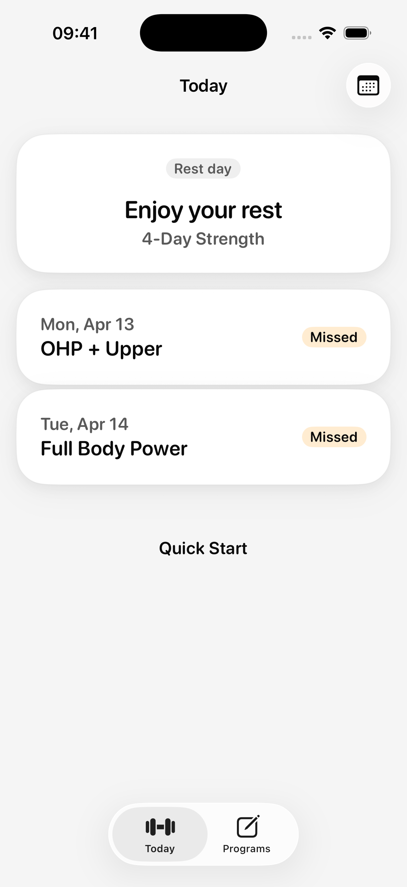
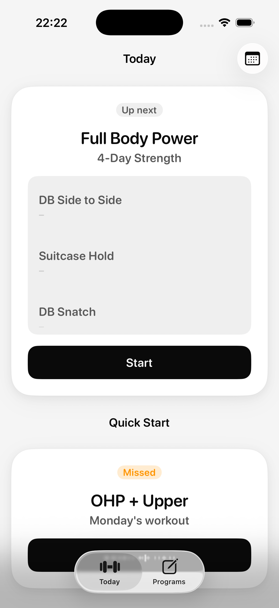
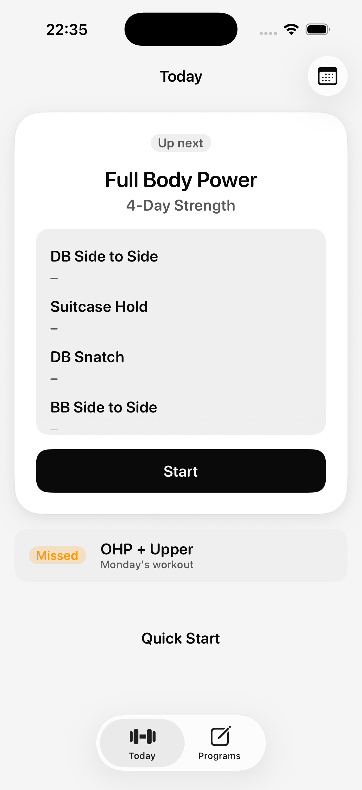

# Components Assessment — 2026-04-15

Goal: find near-duplicate components, point them at the canonical `DesignSystem.swift` equivalent, and list what to delete. You decide which consolidations to ship.

Screenshots live in [`audit-screenshots/components-assessment/`](audit-screenshots/components-assessment/).

---

## TL;DR

- **3 copies of the same missed-workout card** on Today. Visual drift visible in the 3 screenshots below.
- **2 parallel calendar implementations** (`CalendarDayCell` in HistoryView, `CalendarGridDayCell` in CalendarTabView) with identical geometry and slightly different logic.
- **2 identical raw font literals** (`performance font: size 15, rounded`) hand-pasted in HistoryView + TemplateDetailView — not a token.
- **11 places** re-invent a 44-pt circular icon button with 5 different backgrounds (none of which is `AppHeaderIconButton` or `IconSquareButton`).
- **1 dead alias** (`OnboardingProgress` is a legacy re-wrap of `OnboardingProgressBar`).

Estimated cleanup: ~450 lines deletable with zero UX change, plus 6 net-new tokens to lock down the drift.

---

## 1. Visual drift you can see in screenshots

Three different renderings of the same concept ("a workout on Today"):

| State | Screenshot | Card Shape |
|-------|-----------|------------|
| Rest day / multi-miss list | [01-launch.png](audit-screenshots/components-assessment/01-launch.png) | Full `AppCard` • date eyebrow • title • trailing `AppTag` |
| Up next, compact missed row | [04-today-missed-compact.png](audit-screenshots/components-assessment/04-today-missed-compact.png) | Full `AppCard` • `AppTag` on top • title centered • `AppPrimaryButton` |
| Up next, inline missed row | [05-today-preview-list.png](audit-screenshots/components-assessment/05-today-preview-list.png) | Flat row (no card) • `AppTag` + title inline • no button |





**Recommendation:** pick one. Either the list row form (Rest day) or the compact inline form — both should not coexist. The middle variant (card + "Catch up now" CTA) is worth keeping as the *single* entry point when there's one missed workout to catch up on; but then the other two inline/flat versions are redundant.

---

## 2. Design system inventory (already in `Unit/UI/DesignSystem.swift`)

Everything below **already exists** as a canonical component — violations listed in §3 should be rewritten to use these.

**Tokens:** `AppColor` • `AppFont` (13 cases + 9 static fonts) • `AppSpacing` (8 steps) • `AppRadius` (5 steps) • `AppIcon` (40 glyphs)

**Atoms:** `AppTag`, `IconChip`, `AppIconCircle`, `AppDivider`, `AppPrimaryButton`, `AppSecondaryButton`, `AppGhostButton`, `AppStepper`, `AppListRow`, `AppHeaderIconButton`, `IconSquareButton`, `ProductTopBarAction`, `ScaleButtonStyle`

**Molecules / Organisms:** `AppCard`, `AppSessionHighlightCard`, `EmptyStateCard`, `HeroWorkoutCard`, `WorkoutCommandCard`, `ExerciseCommandCard`, `SessionStateBar`, `SettingsSection`, `SheetHeader`, `SheetListRow`, `RestTimerControl`, `MetricDisplay`, `WeeklyProgressStepper`, `SetProgressIndicator`, `ExercisePreviewStrip`, `PreviewListContainer`, `PreviewListRow`, `ExerciseRow`, `DayCard`, `AppDividedList`, `AppSegmentedControl`, `AppTabHeader`, `AppNavBar`, `UnitTabBar`, `AppScreen`, `ScrollEdgeFadeView`

---

## 3. Near-duplicates to delete (ranked by payoff)

### A. `performanceFont` — raw literal, pasted in two places
The **same exact Font literal** exists twice outside the design system:

| File | Line |
|------|------|
| [`HistoryView.swift:770`](Unit/Features/History/HistoryView.swift#L770) | `private static let performanceFont: Font = .system(size: 15, weight: .semibold, design: .rounded).monospacedDigit()` |
| [`TemplateDetailView.swift:181`](Unit/Features/Templates/TemplateDetailView.swift#L181) | — identical — |

**Fix:** add `AppFont.performance` (size 15, semibold, rounded, mono) next to the other static fonts in `AppFont` (DesignSystem.swift:129–137), delete both locals.

### B. Two parallel calendar grids
Both build a month grid with 7 columns, weekday header `["MON", "TUE", ..., "SUN"]`, 32×32 day cells with status-tinted backgrounds, today border, selected accent fill. Same visual language, separate code.

| Canvas | Location | Day cell | Header |
|--------|---------|---------|--------|
| History Calendar tab (old) | [HistoryView.swift:465–689](Unit/Features/History/HistoryView.swift#L465) | `CalendarDayCell` (line 598) — 4 status cases incl. `.partial` | `CalendarMonthHeader` + `CalendarGrid` (uses `AppIconCircle` for chevrons) |
| Calendar tab (new) | [CalendarTabView.swift:232–358](Unit/Features/History/CalendarTabView.swift#L232) | `CalendarGridDayCell` (line 296) — 3 status cases, no `.partial` | Inline HStack + `monthNavButton` (plain, **no** `AppIconCircle`) |

**Drift:**
- Day cell font differs: `AppFont.body` (History) vs `AppFont.caption` (Calendar tab).
- Grid spacing differs: `AppSpacing.smd` (History) vs `AppSpacing.sm` (Calendar tab).
- Chevron buttons look different (circle vs plain).
- `CalendarDayCell` supports `.partial` (warning) status; `CalendarGridDayCell` does not.

**Fix:** lift the grid into a shared `CalendarMonthView` organism under `DesignSystem.swift`. Decide once: 32pt cell, `AppFont.caption`, `AppSpacing.smd`, `AppIconCircle` chevrons, 4 statuses. Delete both local copies.

### C. 44pt icon buttons — five ad-hoc variants
Canonical options already exist: `AppHeaderIconButton` (32→44 hit, elevated), `AppIconCircle` (36pt), `IconSquareButton` (48pt). Despite this, 11 places re-roll their own:

| File:line | Pattern | Should be |
|-----------|---------|-----------|
| [CyclesView.swift:196](Unit/Features/Cycles/CyclesView.swift#L196) | 44×44 circle, `accentSoft` fill, edit icon | `AppHeaderIconButton` or a tinted `IconSquareButton` |
| [CyclesView.swift:233](Unit/Features/Cycles/CyclesView.swift#L233) | — exact same thing, second time — | ditto |
| [TemplateDetailView.swift:146](Unit/Features/Templates/TemplateDetailView.swift#L146) | 32×32 circle inside 44 hit, `background` fill, trash icon | `AppIconCircle(surface: .tinted(.background))` |
| [OnboardingBaselinesView.swift:170](Unit/Features/Onboarding/OnboardingBaselinesView.swift#L170) | 28×28 circle inside 44 hit, `cardBackground` fill, edit icon | `AppIconCircle` |
| [TemplatesView.swift:365](Unit/Features/Templates/TemplatesView.swift#L365) | 44×44 plain tap target, moveUp | `IconSquareButton` or reuse as-is in a toolbar strip |
| [TemplatesView.swift:375](Unit/Features/Templates/TemplatesView.swift#L375) | — same, moveDown | ditto |
| [TemplatesView.swift:386](Unit/Features/Templates/TemplatesView.swift#L386) | 44×44 plain disclosure chevron | `AppIconCircle(surface: .control)` — matches Calendar chevrons |
| [ProgramDetailView.swift:42](Unit/Features/Templates/ProgramDetailView.swift#L42) | 44×44 plain nav-bar edit | Toolbar Button (no chrome) — fine as-is, but harmonise glyph size |
| [OnboardingShell.swift:60](Unit/Features/Onboarding/OnboardingShell.swift#L60) | 44×44 back button, plain | `AppNavBar` already handles this — this helper is dead code |
| [OnboardingSplashView.swift:75](Unit/Features/Onboarding/OnboardingSplashView.swift#L75) | 44×44 — check in context | — |
| [CalendarTabView.swift:217](Unit/Features/History/CalendarTabView.swift#L217) | 44×44 plain chevron | `AppIconCircle` — same as HistoryView does |

**Fix:** collapse to **two** canonical buttons: `AppIconCircle` for 36pt badge-chevrons, and `IconSquareButton` for 48pt primary actions. Delete the 44pt ad-hoc circles — the hit area stays 44 via `.contentShape`.

### D. `OnboardingProgress` is a dead wrapper
```swift
// OnboardingShell.swift:109–117
/// Legacy pill-style progress indicator — kept for backward compatibility.
struct OnboardingProgress: View {
    let step: Int
    let total: Int
    var body: some View {
        OnboardingProgressBar(step: step, total: total)
    }
}
```
Only caller is the also-unused `OnboardingHeader` at line 50 (which `OnboardingShell` doesn't wire up). Both can be deleted.

### E. Cycles status badge duplicates AppTag
[`CyclesView.swift:366–397`](Unit/Features/Cycles/CyclesView.swift#L366) defines an inline `statusBadge(status:)` helper that renders four styles of "Done / Failed / Current / —" chips using hand-rolled `HStack` + `Text` + `AppIcon.checkmarkFilled`. `AppTag` already ships `.success / .error / .accent / .muted` styles plus `IconChip`. Replace.

### F. Cycle row cards (3 locally-defined variants)
| Local view | File:line | Shape |
|-----------|-----------|-------|
| `activeCycleSection` | [CyclesView.swift:179](Unit/Features/Cycles/CyclesView.swift#L179) | `appCardStyle` + VStack title/week |
| `switchableCycleRow` | [CyclesView.swift:216](Unit/Features/Cycles/CyclesView.swift#L216) | `appCardStyle` + title/week + edit circle + "Make Current" capsule |
| `pastCycleRow` | [CyclesView.swift:256](Unit/Features/Cycles/CyclesView.swift#L256) | `appCardStyle` + title/subtitle, no actions |

All three are trailing-action-variants of an `AppListRow`-inside-`AppCard`. **Fix:** one `CycleRow` that takes an optional trailing closure. Saves ~80 lines.

### G. Ad-hoc "secondary action" buttons (icon + label, fill, rounded)
| File:line | Label | Style |
|-----------|------|-------|
| [TemplatesView.swift:275–289](Unit/Features/Templates/TemplatesView.swift#L275) | "Add Day" | `addCircle` + text, 48pt, `controlBackground`, radius `md` |
| [ActiveWorkoutView.swift:451–464](Unit/Features/Today/ActiveWorkoutView.swift#L451) | "Add Exercise" | `add` + text, 44pt, no background |
| [CyclesView.swift:155–168](Unit/Features/Cycles/CyclesView.swift#L155) | "Start New Cycle" | `addCircle` + text, 52pt, `appCardStyle` |
| [TemplatesView.swift:293–303](Unit/Features/Templates/TemplatesView.swift#L293) | "Delete Program" | 48pt, error tint, no fill |

**Fix:** `AppSecondaryButton` already covers this shape — extend it with an optional leading `AppIcon` and optional `.destructive` tint. Delete all four ad-hoc blocks.

### H. Soft-tint pills (`accentSoft` capsules)
| File:line | Use |
|-----------|-----|
| [CyclesView.swift:241–248](Unit/Features/Cycles/CyclesView.swift#L241) | "Make Current" pill |
| [PaywallView.swift:120–122](Unit/Features/Subscription/PaywallView.swift#L120) | benefitRow icon tile (rounded rect, not capsule) |
| [CyclesView.swift:196 & 233](Unit/Features/Cycles/CyclesView.swift#L196) | edit icon circle |
| [OnboardingShell.swift:129–132](Unit/Features/Onboarding/OnboardingShell.swift#L129) | `OnboardingOptionCard` icon tile |

`AppTag` with `.custom(fg: AppColor.accent, bg: AppColor.accentSoft)` would standardise all of these — or more cleanly, add an `AppTag.Style.accentSoft` case.

---

## 4. Token drift to lock down

### Fonts — add to `AppFont`
- `AppFont.performance` — 15pt semibold rounded monospaced (used in set-result rows, PR rows). **Currently pasted as a local `static let` in 2 files.**

### Colors — add to `AppColor`
Calendar cells and status badges mix ad-hoc opacity values:

| Current literal | Files | Suggested token |
|-----------------|-------|-----------------|
| `AppColor.success.opacity(0.18)` | HistoryView:631, CalendarTabView:321 | `AppColor.successSoft` |
| `AppColor.warning.opacity(0.22)` | HistoryView:633 | `AppColor.warningSoft` |
| `AppColor.error.opacity(0.18)` | HistoryView:635, CalendarTabView:323 | `AppColor.errorSoft` |
| `AppColor.error.opacity(0.4)` | CyclesView:402 | `AppColor.errorBorder` or same `errorSoft` |
| `AppColor.textPrimary.opacity(0.34)` | HistoryView:646, CalendarTabView:344 | `AppColor.borderEmphasis` |
| `AppColor.border.opacity(0.6)` | CalendarTabView:398, PaywallView:168, OnboardingShell:153 | `AppColor.borderSoft` |
| `AppColor.textSecondary.opacity(0.45)` | HistoryView:506, CalendarTabView:216 | `AppColor.textDisabled` |

Picking 3 new tokens (`successSoft`, `warningSoft`, `errorSoft`) kills 6 of the 7 sites and removes the "is this 0.18 or 0.22" noise.

### Radii — one inconsistency
- `AppRadius.sm = 10`, `AppRadius.md = 14`, `AppRadius.lg = 30`, `AppRadius.card = 30`, `AppRadius.sheet = 40`.
- `AppRadius.card` is an alias for `AppRadius.lg`. Nothing in the codebase uses `AppRadius.card`. → delete it.

---

## 5. "Close but slightly wrong" inside the design system itself

Looked at DesignSystem.swift for internal duplication — found two:

### `AppNavBar` vs `AppNavBarWithTextTrailing`
[`DesignSystem.swift:294–404`](Unit/UI/DesignSystem.swift#L294) — two structs with 90% identical bodies. The difference: whether the trailing slot renders just text or icon+text together. Could become one `AppNavBar` with `.trailing(.none | .icon(…) | .text(…) | .iconAndText(…, …))`. Saves ~110 lines.

### `HeroWorkoutCard` vs `WorkoutCommandCard` vs `ExerciseCommandCard`
[`DesignSystem.swift:1642`](Unit/UI/DesignSystem.swift#L1642), 1687, 1779 — three cards for three near-identical layouts: "stepper + title + metric + primary CTA + optional timer strip".
- `HeroWorkoutCard` = Today hero (weekly stepper + preview strip)
- `WorkoutCommandCard` = Active workout (set stepper + optional rest timer)
- `ExerciseCommandCard` = a thin wrapper around `WorkoutCommandCard` that just remaps state and adds a `setLabel`

`ExerciseCommandCard` should be deleted outright — it does nothing but re-type `WorkoutCommandCard.State`. Check callers: if none pass `setLabel` differently, it's free.

---

## 6. Ordered consolidation plan (so you can pick)

**Zero-risk deletes (do these first):**
1. Delete `OnboardingProgress` alias + unused `OnboardingHeader` (OnboardingShell.swift:50 & 110).
2. Delete `AppRadius.card` alias.
3. Replace inline `CyclesView.statusBadge(…)` with `AppTag`.
4. Replace the 2 local `performanceFont` literals with a new `AppFont.performance`.
5. Delete `ExerciseCommandCard` if no call site passes it differently from `WorkoutCommandCard`.

**Token additions:**
6. Add `AppColor.successSoft / warningSoft / errorSoft`.
7. Add `AppFont.performance`.

**Small consolidations:**
8. Point all 44pt edit/trash/move circles at `AppIconCircle` (8 sites).
9. Extend `AppSecondaryButton` with leading icon + destructive tint; replace Add Day / Add Exercise / Delete Program / Start New Cycle ad-hoc buttons.
10. Merge `AppNavBar` + `AppNavBarWithTextTrailing`.

**Bigger consolidation (own PR):**
11. Lift calendar grid + day cell to a shared `CalendarMonthView` organism; delete HistoryView's + CalendarTabView's local copies.
12. Unify Today's missed-workout renderings into one component with 2 variants (hero catch-up card vs quiet list row).
13. Merge 3 CyclesView row helpers into one `CycleRow`.

**Deletable line-count estimate:** 130 (zero-risk) + 90 (medium) + 230 (big) ≈ **450 lines**, with the system visibly quieter because there's one calendar, one missed-card, one icon-circle, and one secondary button.

---

## Screenshots captured this run

| # | State | File |
|---|------|------|
| 01 | Today — Rest day + two missed | `audit-screenshots/components-assessment/01-launch.png` |
| 02 | Today — dark mode (renders identical; app doesn't re-render instantly on appearance toggle — see §visual) | `audit-screenshots/components-assessment/02-today-dark.png` |
| 03 | Today — Up next card with preview list (historical) | `audit-screenshots/components-assessment/03-today-up-next.png` |
| 04 | Today — Missed "Catch up now" compact card (historical) | `audit-screenshots/components-assessment/04-today-missed-compact.png` |
| 05 | Today — Inline missed row under Up next (historical) | `audit-screenshots/components-assessment/05-today-preview-list.png` |

Other screens (Programs, Calendar tab, Settings, Active Workout, Onboarding) weren't captured in this run because the simulator's accessibility bridge is off and I can't tap through; the code-level findings in §3–5 don't depend on fresh screenshots. If you want fresh captures of a specific screen, boot the sim, navigate there manually, and I'll re-run the analysis with visual cross-check.
